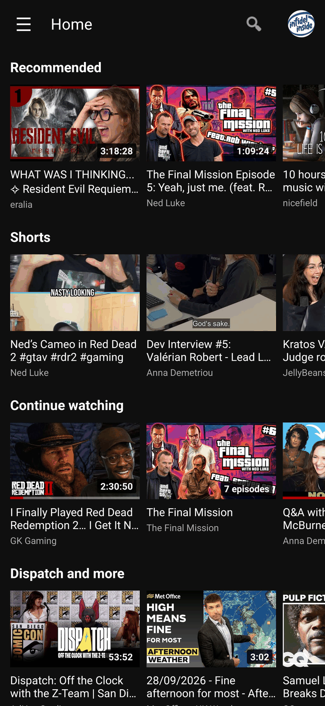
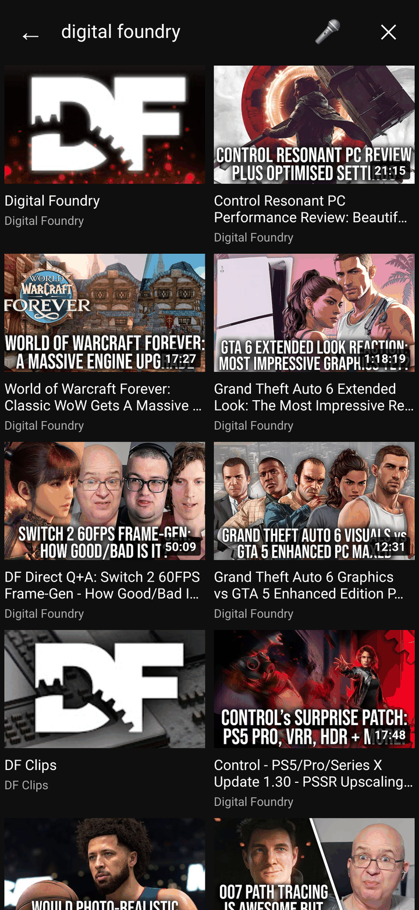
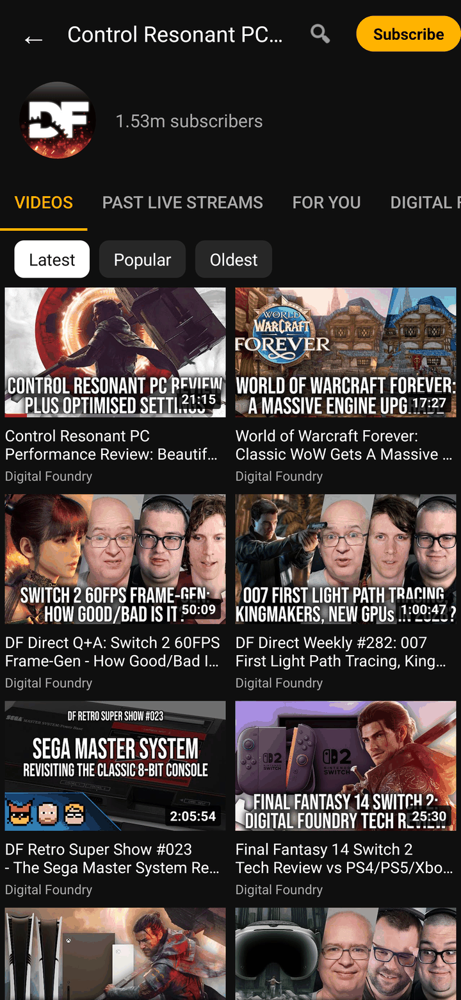
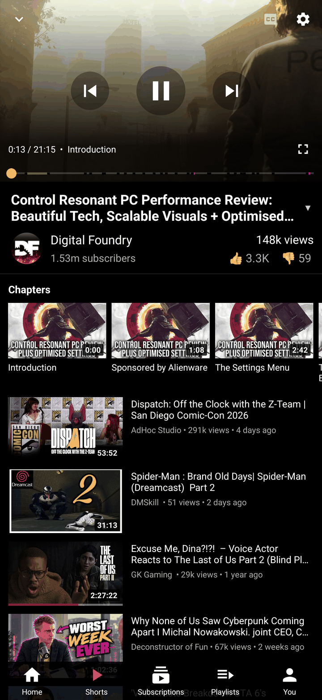
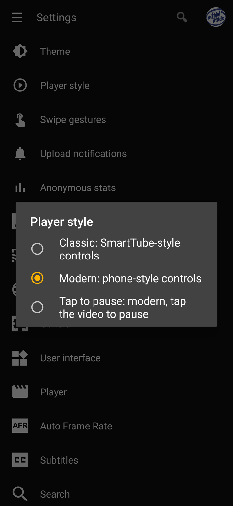
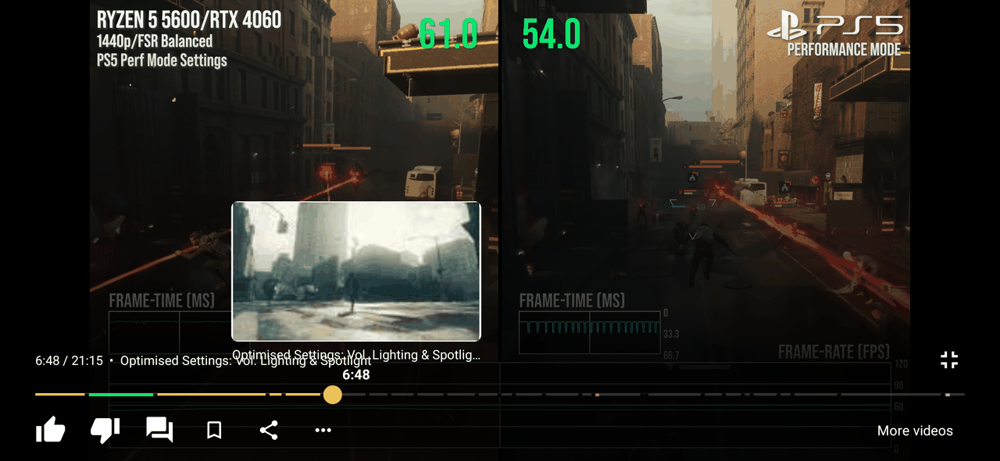
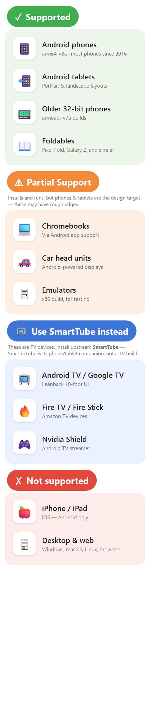

# SmarterTube

**Ad-free YouTube for Android phones and tablets.**

SmarterTube is **not a patched YouTube app and not a wrapper** — it is a native Android phone/tablet UI built on SmartTube's existing YouTube client engine.

It is a fork of [SmartTube](https://github.com/yuliskov/SmartTube) by yuliskov, and a **companion to it, not a replacement**: SmartTube is for Android TV and set-top boxes, SmarterTube is for touchscreen phones and tablets. It adds a native touch UI (portrait home, search, channel pages, a phone-style player, Shorts, settings, sign-in) on top of SmartTube's YouTube client engine, which is merged from upstream on every release. Because it is built on the SmartTube engine, you also get SmartTube's ad-free playback, SponsorBlock, Return YouTube Dislike, DeArrow, background play and more.

> **Beta.** Core flows (Home, Search, channels, playback, Shorts, Settings, sign-in) work and have been checked on phones in portrait and landscape and on tablets. A few upstream options are still reachable only through the Settings screens, and some rows in the [feature matrix](docs/FEATURE_MATRIX.md) haven't been re-verified yet. Unlike app-modifiers, these are real native Android screens, not a repackaged YouTube APK.
>
> Earlier `31.xx-mobile-1.x` builds were published as full `1.x` releases too early. SmarterTube is now reset to a beta line with a clearer version scheme — see [Versioning & releases](#versioning--releases).

### Highlights

- **Native phone & tablet UI**: portrait home with a navigation drawer, search with voice input, and settings with touch-friendly pickers and sliders.
- **Modern, Classic or Tap to pause player**: phone-style controls by default, or SmartTube's original control rows. In landscape, swipe up/down to change volume (right side) or brightness (left side).
- **Seek previews, SponsorBlock and chapters**: drag the seek bar to see a preview frame with the chapter name. Sponsor segments and chapter marks show on the bar, and the chapters also appear as a strip above the up-next list.
- **Portrait player** with up-next list, in-panel comments (read-only) and Save to playlist.
- **Shorts player**: swipe up/down between Shorts, tap to pause, like/dislike/comments/channel on the side.
- **Channel pages**: Videos / Shorts / Live / Playlists tabs, Latest / Popular / Oldest sort, search inside a channel, and Subscribe + notification bell.
- **Upload notifications** for your subscriptions (opt-in), plus a Notifications tab.
- **Ad-free, SponsorBlock, Return YouTube Dislike, DeArrow, background play, picture-in-picture**, all from the SmartTube engine, with no Google Play Services needed.
- **Easy to install and keep updated**: GitHub Releases, [Obtainium](#auto-updates-via-obtainium) or SmarterTube's own [F-Droid repo](#install-via-f-droid-self-hosted-repo). The app tells you when a new release is out and shows what's new after you update.

<p align="center">
  
  &nbsp;&nbsp;
  
  &nbsp;&nbsp;
  
</p>

<p align="center">
  
  &nbsp;&nbsp;
  
  &nbsp;&nbsp;
  
</p>

<p align="center">
  
</p>

---

## Relationship to SmartTube

SmarterTube is an **unofficial fork** of [yuliskov/SmartTube](https://github.com/yuliskov/SmartTube). The playback/client engine, ad blocking, SponsorBlock, Return YouTube Dislike and DeArrow integration — all the under-the-hood behaviour — come from upstream SmartTube, unchanged. This fork's job is to provide a native phone/tablet interface while keeping the upstream structure intact, so non-UI updates can be merged in regularly.

---

## Versioning & releases

SmarterTube is currently **beta**. It uses its own product version and records the upstream SmartTube base separately:

```text
v0.4.0-beta.1+st31.93
   |              |
   |              +-- upstream SmartTube base (metadata only)
   +-- SmarterTube product version (semver + release channel)
```

- The SmarterTube app version (`v0.4.0-beta.1`) is tracked **separately** from the upstream SmartTube base (`st31.93`).
- Earlier `31.xx-mobile-1.x` releases mixed those two numbers and were marked as full `1.x` releases prematurely. They are **superseded** by this beta reset and are treated as legacy by the updater.
- Public **beta/stable** releases normally track **SmartTube stable**. Upstream SmartTube **beta/head** is used only for SmarterTube **alpha** builds or emergency YouTube-breaking fixes (called out in the release notes).

Full policy: [docs/VERSIONING.md](docs/VERSIONING.md) · [docs/RELEASE_PROCESS.md](docs/RELEASE_PROCESS.md) · [docs/UPDATER_COMPATIBILITY.md](docs/UPDATER_COMPATIBILITY.md). Per-release status lives in [docs/FEATURE_MATRIX.md](docs/FEATURE_MATRIX.md) and [docs/KNOWN_ISSUES.md](docs/KNOWN_ISSUES.md).

---

## Why this exists

Upstream SmartTube is built for Android TV — a leanback, 10-foot, D-pad interface. Phones and tablets need touch-native navigation instead. SmarterTube adds that UI while preserving upstream compatibility, so engine and feature updates keep flowing in from SmartTube.

| Project | Approach |
|---|---|
| SmartTube (upstream) | Android TV / leanback (10-foot) UI |
| SmarterTube (this fork) | Native phone/tablet touch UI on SmartTube's engine |
| App-patching tools | Patch or modify the official YouTube app itself |

---

## Device compatibility

SmarterTube is for **Android phones and tablets** with a touchscreen, running **Android 4.2 or newer**. It is a companion to [SmartTube](https://github.com/yuliskov/SmartTube), not a replacement: TV devices should run upstream SmartTube, and the app declares a touchscreen requirement so app stores don't offer it on TVs. It is not available for iPhone/iPad or desktop.

<p align="center">
  
</p>

The chart's source is [`images/compatibility.html`](images/compatibility.html).

---

## Download

[**GitHub Releases →**](https://github.com/CodeSculptor/SmarterTube/releases)

Pick the APK for your device:

| ABI | Who needs it |
|---|---|
| `arm64-v8a` | Most Android phones made after 2016 |
| `armeabi-v7a` | Older 32-bit devices |
| `x86` | Emulators |
| `universal` | Everything — larger file |

SmarterTube installs as `com.codesculptor.smartertube` and is **co-installable** with the upstream SmartTube TV build (`app.smarttube`). They do not conflict.

> **Upgrading from a build before this rename?** Versions up to `v0.4.2-beta.8` shipped under the old package `app.smarttube.mobile`. The new id is a separate app, so it installs *alongside* the old one rather than upgrading it — uninstall the old SmarterTube after installing this one. Settings and signed-in accounts do not carry over and need to be set up again (one-time).

### Auto-updates via Obtainium

SmarterTube is not on any app store. [Obtainium](https://github.com/ImranR98/Obtainium) installs and auto-updates apps straight from their GitHub Releases — no store and no central repository involved:

1. Install Obtainium (itself sideloaded from its own GitHub Releases).
2. **Add App** → paste `https://github.com/CodeSculptor/SmarterTube`.
3. Obtainium tracks each new release automatically; choose the `arm64-v8a` asset (or `universal`) when prompted.

This is the easiest way to stay current.

### Install via F-Droid (self-hosted repo)

SmarterTube runs its **own** F-Droid repository — the same APKs as GitHub Releases, signed with the same key, so installs upgrade in place. It is a self-hosted repo (not the official F-Droid index): you add it once in the F-Droid client and get auto-updates.

1. Install [F-Droid](https://f-droid.org/) (or a compatible client such as Droid-ify).
2. **Settings → Repositories → Add** this URL (fingerprint included so the client verifies it):

   ```
   https://codesculptor.github.io/SmarterTube/fdroid/repo?fingerprint=C7AE86B0A3291B5D7396411BE185C60B298C9D25012172DDFC859B25B540A46B
   ```

3. Refresh, search for **SmarterTube**, and install. Updates then arrive through F-Droid automatically.

> The repo serves SmarterTube's own builds only; it is not affiliated with the official F-Droid repository or with upstream SmartTube.

Official builds are published only on this GitHub Releases page (and the SmarterTube F-Droid repo above) unless another source is explicitly linked here.

### Verifying your download

Release APKs are named `SmarterTube-<version>-st<base>-<arch>.apk` (e.g. `SmarterTube-v0.4.0-beta.1-st31.93-arm64-v8a.apk`).

Every APK on the Releases page carries a **SHA-256 digest**, shown by GitHub next to the asset. After downloading, compare it against the file on your device:

```bash
# Linux/macOS
sha256sum SmarterTube-*.apk
# Windows (PowerShell)
Get-FileHash SmarterTube-*.apk -Algorithm SHA256
```

If the hash matches the one GitHub shows for that asset, the file is intact.

---

## What works

### Phone UI (this fork adds)

**Browsing**
- Portrait home screen with drawer navigation (Notifications, Home, Shorts, Kids, Sports, LIVE, Gaming, News, Music, Channels, Subscriptions, History, Playlists, My videos, Settings)
- Search with suggestions, a results grid and voice search
- Channel pages: avatar and subscriber count, Subscribe / Unsubscribe and notification bell, Videos / Shorts / Live / Playlists tabs, Latest / Popular / Oldest sort, search inside the channel, 9:16 Shorts cards and playlist cards with a video count
- Thumbnails show the video length and a red watched-progress bar
- Long-press a video for the SmartTube video menu (Home, search, channels and the up-next list)

**Player**
- Player style (Settings > Player style): **Modern** phone-style controls (default for new installs), **Tap to pause** (tap plays/pauses, double tap seeks), or **Classic** SmartTube control rows
- Modern seek bar: preview frames while dragging, SponsorBlock segments and chapter marks on the bar, and the current chapter next to the time
- Chapters strip at the top of the up-next list (portrait panel and landscape "More videos"); tap a chapter to jump to it
- Swipe gestures in the landscape player: up/down on the right for volume, on the left for brightness (Settings > Swipe gestures)
- Portrait player: video on top, with channel row, like/dislike, up-next list, in-panel comments (read-only) and a bottom bar with Save to playlist
- Rotate for full-screen landscape playback, or use the full-screen button
- Settings sheets (speed, quality, captions…) open as a bottom sheet over the video
- Shorts player: swipe up/down for the next Short, tap to pause, side rail with like/dislike/comments/channel, seek bar; fitted with side bars on tablets and foldables
- Picture-in-picture pop-up, and background audio with lock-screen media controls

**Account & notifications**
- Sign in / sign out with the OAuth device-code flow in an in-app browser tab. Switch between accounts with one tap on the toolbar avatar (long-press to manage accounts), or from Settings
- New-upload notifications from your subscriptions (opt-in; you're asked once after signing in), and a Notifications tab listing those uploads

**Settings & app**
- Settings built for touch: pickers in bottom sheets, sliders for numeric values, and long checkbox screens folded into sections
- Phone-only settings at the top: Theme, Player style, Swipe gestures, Upload notifications, Anonymous stats
- Update notice on launch when a new release is out, and a short "What's new" after you update
- Opt-in anonymous usage stats and crash reports (off unless you say yes; see [PRIVACY.md](PRIVACY.md)). The totals are public: [smartertube-stats.codesculptor.workers.dev](https://smartertube-stats.codesculptor.workers.dev/)
- Tablet layouts in portrait and landscape (more grid columns, Shorts fitted to the screen)

### Built on the SmartTube engine, so you also get
- No ads
- SponsorBlock (skip or mark sponsor segments, per-channel exclusions)
- Return YouTube Dislike
- DeArrow
- Background play and picture-in-picture
- Voice search
- Adjustable playback speed
- Up to 8K / 60fps / HDR
- Remote control: link the YouTube app on another device to SmarterTube (Settings > Remote control)
- No Google Play Services required

---

## Known limitations & risks

SmarterTube is a **beta** release. A few realities are worth knowing before you install:

- **Some upstream options live only in Settings.** The phone UI covers the core journey (Home, Search, channels, playback, Shorts, sign-in); a few SmartTube options have no button of their own and are only in the Settings screens.
- **Upstream / YouTube breakage** — YouTube changes its private APIs without warning, which can break playback at any time. Fixes depend on upstream SmartTube's cadence, then a re-merge here.
- **Sideload only** — not on any app store. Install the APK yourself from Releases, or use [Obtainium](#auto-updates-via-obtainium) to install and auto-update directly from GitHub.
- **No guarantees** — this is an independent fork with no affiliation to Google/YouTube or to upstream SmartTube's author.

Specific gaps:

- **Comments are read-only** — you can read comments in the player, but posting needs YouTube sign-in work that isn't done yet.
- **No YouTube notification inbox** — YouTube's own inbox isn't available to this client; the Notifications tab lists new uploads from your subscriptions instead.
- **Updates install manually** — the app tells you when a new release is out and opens the download, but you install the APK yourself (or let Obtainium / F-Droid do it).
- **No seeking from the lock screen** — background audio has lock-screen media controls, but they can't seek within the video.
- **TV / leanback interface** — install [upstream SmartTube](https://github.com/yuliskov/SmartTube) for Android TV boxes and sticks.
- **Official F-Droid / IzzyOnDroid index** — not listed there; instead use GitHub Releases, [Obtainium](#auto-updates-via-obtainium), or SmarterTube's own [F-Droid repo](#install-via-f-droid-self-hosted-repo).
- **Casting to a Chromecast** — not supported, same as upstream SmartTube: sending to a Chromecast needs Google's Cast SDK, which requires Google Play Services, and SmartTube is deliberately built without them. The reverse works: under Settings > Remote control, the YouTube app on another device can link to SmarterTube and control playback.

---

## Community & support

- Telegram: https://t.me/SmarterTubeApp
- Discord: https://discord.gg/kVCkEWvEjt
- Bug reports: https://github.com/CodeSculptor/SmarterTube/issues

---

## Building

Requires JDK 17 and Android SDK.

```bash
# Debug
./gradlew :smarttubetv:assembleStmobileDebug

# Release (needs keystore.properties + smartertube-release.jks at repo root)
./gradlew :smarttubetv:assembleStmobileRelease
```

Output APKs land in `smarttubetv/build/outputs/apk/stmobile/`.

All phone-specific code lives under `smarttubetv/src/stmobile/` — no changes to `src/main` (TV code) except bug fixes that benefit both targets, which are submitted upstream.

---

## Upstream & maintenance

The YouTube client engine (MediaServiceCore, ExoPlayer, InnerTube API code) is upstream's work and is merged from [yuliskov/SmartTube](https://github.com/yuliskov/SmartTube) on every release. Bug fixes that apply to both the TV and phone targets are submitted upstream rather than kept here — see open PRs for current patches. (Code layout is described under [Building](#building).)

Licensed under [MIT](LICENSE), same as upstream.

---

## Privacy

See [PRIVACY.md](PRIVACY.md).
